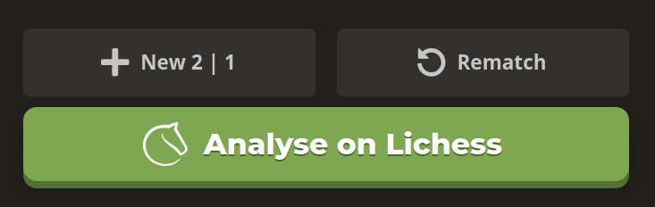

# Analyse Chess.com games on Lichess

This Firefox extension adds a button to the game page (once it's finished) to automatically send the game to the amazing Lichess analysis page.

I know that it's better to play on Lichess, but sometimes you might want to (or have to) play on Chess.com. Since Chess.com analysis is paid and far from perfect, this extension will help you to analyse your games on Lichess.

**Note**: this extension is still in development and might be a bit buggy. If the button does not appear or work, try refreshing the page.

## Screenshots

## Installation

Install the extension from [Firefox Add-ons](https://addons.mozilla.org/en-US/firefox/addon/chesscom2lichess/).

## Contributing

If you want to contribute or suggest a feature, feel free to open a pull request or an issue.
